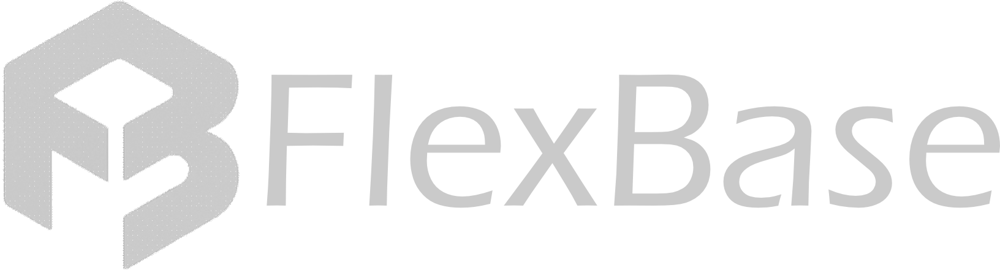

FlexBase é uma plataforma de **BaaS (Backend as a Service)** que gera **endpoints de API** a partir de um **modelo de diagrama de banco de dados**, tendo **JSON como base de funcionamento**.

A ideia é simples: você descreve a estrutura do seu banco (tabelas, campos e relacionamentos) em uma interface intuitiva e profissional, e a FlexBase cria automaticamente os endpoints necessários para o seu backend.

---

## Objetivo

Facilitar a criação de backends para aplicações, eliminando a necessidade de escrever CRUDs repetitivos.  
Com a FlexBase você:

- Modela o banco de dados uma vez;
- Gera endpoints REST automaticamente;
- Usa a plataforma como BaaS para aplicações web, mobile ou serviços internos.

---

##  Principais Recursos

- Geração automática de endpoints a partir de um modelo de BD.
- Suporte a entidades (tabelas), campos e relacionamentos.
- Padronização de respostas em JSON.
- Pensado para uso como BaaS (Backend as a Service).
